# 티스토리형 블로그 ERD (기본안)

`1팀_블로그_통합_기능명세서.md` v0.2 기준. 기능 ID(POST-01 등)는 명세서와 같다.
DB 종류와 컬럼 타입은 각자 개인 설계 문서에서 정하므로, 여기서는 논리 모델만 둔다.

## 1. ERD

```mermaid
erDiagram
    USER ||--o{ BLOG : "개설(owner)"
    USER |o--o| BLOG : "대표 블로그"
    USER ||--o{ POST_LIKE : "공감"
    USER ||--o{ POST_SAVE : "저장"
    USER ||--o{ COMMENT : "작성"
    USER ||--o{ GUESTBOOK : "작성"
    USER ||--o{ SUBSCRIPTION : "구독"
    USER ||--o{ NOTIFICATION : "수신"
    USER ||--o{ REPORT : "신고"
    USER ||--o{ USER_SANCTION : "제재 대상"
    USER ||--o{ ADMIN_LOG : "관리자 처리"
    USER ||--o{ NOTICE : "공지 작성"
    USER ||--o{ IMAGE : "업로드"

    BLOG |o--o{ BLOG : "이사 간 블로그"
    BLOG ||--o{ POST : "소유"
    BLOG ||--o{ CATEGORY : "보유"
    BLOG ||--o{ TAG : "보유"
    BLOG ||--o{ GUESTBOOK : "받음"
    BLOG ||--o{ SUBSCRIPTION : "구독 대상"
    BLOG ||--o{ BLOG_BLOCKED_USER : "회원 차단"
    BLOG ||--o{ BLOG_BANNED_WORD : "금칙어"
    BLOG ||--o{ VISIT_STAT : "방문 통계"
    BLOG ||--o{ POST_MOVE : "옛 소속"

    CATEGORY |o--o{ CATEGORY : "하위(1단계)"
    CATEGORY |o--o{ POST : "분류(null=미분류)"
    TOPIC |o--o{ POST : "주제"

    POST ||--o{ POST_TAG : "태그 연결"
    TAG ||--o{ POST_TAG : "글 연결"
    POST |o--o{ IMAGE : "본문 이미지"
    POST ||--o{ COMMENT : "댓글"
    POST ||--o{ POST_LIKE : "공감받음"
    POST ||--o{ POST_SAVE : "저장됨"
    POST ||--o{ POST_MOVE : "이사 기록"
    POST |o--o{ NOTIFICATION : "관련 글"

    COMMENT |o--o{ COMMENT : "답글(1단계)"

    USER {
        bigint id PK
        bigint primary_blog_id FK "대표 블로그(BLOG-08)"
        string email UK "이메일 로그인 시(7.1)"
        string password_hash "이메일 로그인 시(7.1)"
        string social_provider "소셜 로그인 시(7.1)"
        string social_id "provider + social_id 유일"
        string nickname
        string profile_image_url
        string role "MEMBER | ADMIN"
        datetime created_at
        datetime withdrawn_at "AUTH-06"
    }

    BLOG {
        bigint id PK
        bigint owner_id FK
        bigint moved_to_blog_id FK "BLOG-06 이사 간 블로그"
        int topic_id FK "7.7: 블로그마다 지정 시"
        string address UK "4~32자, 변경 불가, 삭제돼도 행 유지"
        string name "1~40자(기준안)"
        string description "비워 둘 수 있음"
        string profile_image_url
        string skin "BLOG-05"
        string background_image_url "BLOG-05"
        datetime restricted_at "ADMIN-05 이용 제한"
        string restricted_reason "ADMIN-05"
        datetime created_at
        datetime deleted_at "BLOG-07, 소프트 삭제"
    }

    RESERVED_WORD {
        string word PK "login, admin, api 등"
    }

    TOPIC {
        int id PK
        string name UK "IT, 여행 등"
        int sort_order
    }

    CATEGORY {
        bigint id PK
        bigint blog_id FK
        bigint parent_id FK "null이면 최상위"
        string name "1~20자(기준안), blog+parent+name 유일"
        int sort_order "CAT-04"
        boolean is_private "CAT-05"
    }

    POST {
        bigint id PK
        bigint blog_id FK
        bigint category_id FK "null이면 미분류"
        int topic_id FK "7.7: 글마다 지정 시, null이면 주제 없음"
        string slug "7.5 제목 기반 시, 첫 발행에 고정"
        string title "1~100자(기준안)"
        text content
        string content_format "7.4 MARKDOWN | HTML"
        string thumbnail_url "null이면 본문 첫 이미지"
        string visibility "PUBLIC | PRIVATE (+PROTECTED | SUBSCRIBER)"
        string protected_password_hash "7.8 보호글 시"
        string status "DRAFT | SCHEDULED | PUBLISHED"
        boolean comment_allowed "CMT-07"
        int view_count "POST-09"
        datetime scheduled_at "POST-13"
        datetime published_at "실제 공개 시각, 수정해도 불변"
        datetime hidden_at "ADMIN-03 관리자 숨김"
        string hidden_reason "ADMIN-03"
        datetime created_at
        datetime updated_at
    }

    POST_MOVE {
        bigint id PK
        bigint post_id FK
        bigint from_blog_id FK
        string from_slug "옛 주소(7.5 제목 기반 시)"
        datetime moved_at
    }

    IMAGE {
        bigint id PK
        bigint uploader_id FK
        bigint post_id FK "본문 이미지면 글, 아니면 null"
        string url
        string mime_type "jpg | png | gif | webp"
        int size_bytes
        datetime created_at
    }

    TAG {
        bigint id PK
        bigint blog_id FK
        string name "blog_id + name 유일"
    }

    POST_TAG {
        bigint post_id PK, FK
        bigint tag_id PK, FK "글당 최대 10개"
    }

    COMMENT {
        bigint id PK
        bigint post_id FK
        bigint author_id FK
        bigint parent_id FK "답글(CMT-05), 1단계만"
        string content "1~1000자"
        boolean is_secret "CMT-06"
        datetime hidden_at "ADMIN-03 관리자 숨김"
        string hidden_reason "ADMIN-03"
        datetime created_at
        datetime updated_at
        datetime deleted_at "답글 있으면 '삭제된 댓글' 표시"
    }

    GUESTBOOK {
        bigint id PK
        bigint blog_id FK
        bigint author_id FK
        string content "1~1000자"
        datetime created_at
    }

    POST_LIKE {
        bigint user_id PK, FK
        bigint post_id PK, FK "회원당 글마다 한 번"
        datetime created_at
    }

    POST_SAVE {
        bigint user_id PK, FK
        bigint post_id PK, FK
        datetime created_at
    }

    SUBSCRIPTION {
        bigint subscriber_id PK, FK
        bigint blog_id PK, FK "블로그 단위, 자기 블로그 불가"
        datetime created_at
    }

    NOTIFICATION {
        bigint id PK
        bigint user_id FK "수신자"
        string type "COMMENT | LIKE | SUBSCRIBE | NEW_POST"
        bigint actor_id FK "수신자와 같으면 만들지 않음"
        bigint blog_id FK "SUBSCRIBE 대상 블로그"
        bigint post_id FK "글 삭제 시 함께 삭제"
        bigint comment_id FK
        boolean is_read
        datetime created_at
    }

    BLOG_BLOCKED_USER {
        bigint blog_id PK, FK
        bigint user_id PK, FK "MNG-04 댓글·방명록 차단"
        datetime created_at
    }

    BLOG_BANNED_WORD {
        bigint id PK
        bigint blog_id FK
        string word "blog_id + word 유일"
    }

    VISIT_STAT {
        bigint blog_id PK, FK
        date visit_date PK
        int visitor_count "MNG-03"
    }

    REPORT {
        bigint id PK
        bigint reporter_id FK
        string target_type "POST | COMMENT"
        bigint target_id "reporter + target 유일"
        string reason_code "고른 사유"
        string status "PENDING | HIDDEN | REJECTED"
        bigint handled_by FK
        datetime created_at
        datetime handled_at
    }

    USER_SANCTION {
        bigint id PK
        bigint user_id FK
        bigint admin_id FK
        string reason
        datetime starts_at
        datetime ends_at "null이면 영구"
        datetime released_at "관리자가 미리 해제"
    }

    ADMIN_LOG {
        bigint id PK
        bigint admin_id FK
        string action "HIDE_POST | UNHIDE_POST | SUSPEND_USER 등"
        string target_type
        bigint target_id
        string reason
        datetime created_at "수정·삭제 불가"
    }

    NOTICE {
        bigint id PK
        bigint admin_id FK
        string title
        text content
        datetime created_at
    }
```

## 2. 엔티티와 기능 대응

| 엔티티 | 관련 기능 | 비고 |
| --- | --- | --- |
| USER | AUTH-01~06, BLOG-08 | 역할은 MEMBER·ADMIN 둘뿐. 블로그 주인은 `BLOG.owner_id`로 판단한다 |
| BLOG, RESERVED_WORD | BLOG-01~07, ADMIN-05, 4.2 | 주소 변경 불가. 삭제해도 행을 남겨 주소를 영구 예약한다 |
| POST, IMAGE | POST-01~13, 4.6 | |
| POST_MOVE | BLOG-06, 4.3 | 이사한 글의 옛 주소를 새 주소로 이동시킨다 |
| CATEGORY, TOPIC | CAT-01~05, POST-11, HOME-03 | 카테고리는 글 하나에 하나, 하위는 한 단계 |
| TAG, POST_TAG | TAG-01~04 | 태그는 블로그 단위 |
| COMMENT, GUESTBOOK | CMT-01~07 | 비회원 댓글 없음 |
| POST_LIKE, POST_SAVE | SOC-01, SOC-03 | 복합 PK로 중복 공감을 막는다(8.3) |
| SUBSCRIPTION, NOTIFICATION | SUB-01~06 | 맞구독은 양방향 조회로 계산하므로 테이블이 없다 |
| BLOG_BLOCKED_USER, BLOG_BANNED_WORD, VISIT_STAT | MNG-03, MNG-04 | P2 |
| REPORT, USER_SANCTION, ADMIN_LOG, NOTICE | ADMIN-02~06 | P1~P2 |

## 3. 설계 결정

1. **'미분류'와 '전체 글'은 행으로 만들지 않는다.** 새 블로그는 카테고리 없이 시작하고(CAT-01), `POST.category_id`가 null이면 미분류다. 카테고리를 삭제하거나 글이 이사하면 `category_id`를 null로 바꾼다. 이름 변경·삭제가 불가능한 것도 행이 없으니 자연히 지켜진다.
2. **관리자 숨김은 글·댓글 상태와 분리한다.** `hidden_at`·`hidden_reason`을 따로 둬서, 숨김을 풀면 발행 상태·공개 범위가 원래대로 돌아간다(6.12 ②). 글쓴이에게는 사유가 보인다(ADMIN-03).
3. **회원 이용 제한은 USER에 상태로 두지 않는다.** 기한이 지나면 자동으로 풀려야 하므로(ADMIN-02 ③) `USER_SANCTION`에서 `starts_at <= now < ends_at`이고 `released_at`이 null인 행이 있는지로 판단한다.
4. **글 삭제는 실제 삭제하고 연쇄 삭제한다.** POST를 지우면 COMMENT, POST_LIKE, POST_SAVE, NOTIFICATION, POST_TAG, POST_MOVE가 함께 사라진다(4.7). 한 트랜잭션으로 묶는다(8.3). 블로그만 소프트 삭제다(주소 예약).
5. **댓글은 소프트 삭제한다.** 답글이 달린 댓글은 '삭제된 댓글'로 표시해야 하므로 `deleted_at`을 쓴다(CMT-05). 답글이 없으면 실제로 지워도 된다.
6. **목록 정렬은 `published_at` 내림차순, 같으면 `created_at` 내림차순이다**(4.4). 예약 발행은 실제로 공개된 시각을 `published_at`에 넣는다(POST-13).
7. **집계 값은 저장하지 않는 것을 기본으로 한다.** 공감 수·댓글 수·구독자 수·글 수는 볼 수 있는 글만 세야 하므로(4.4 ⑤) COUNT로 계산한다. 캐시 컬럼을 둘 경우 실제 값과 항상 같아야 한다(8.3).
8. **볼 수 있는지는 명세서 순서대로 판단한다**(POST-04 ③): 존재 → `blog_id` 소속(아니면 POST_MOVE 확인) → `BLOG.restricted_at` → `POST.hidden_at` → 블로그 주인 여부 → `status`·`visibility`·`CATEGORY.is_private`. 하나라도 걸리면 404다.
9. **블로그 이사 체인.** `BLOG.moved_to_blog_id`를 따라가면 A→B→C도 C로 연결된다(BLOG-06 ④). 블로그를 삭제해도 행이 남으므로 이사 안내는 계속 동작한다(BLOG-07 ②).
10. **REPORT의 대상은 다형 참조(`target_type` + `target_id`)로 둔다.** 신고 대상은 글·댓글뿐이다(ADMIN-04).

## 4. 선택 항목(7장)별 스키마 영향

| 선택 항목 | 선택지 | 스키마 변화 |
| --- | --- | --- |
| 7.1 로그인 방식 | 이메일 | `email`, `password_hash` 사용 |
| | 소셜 | `social_provider`, `social_id` 사용 |
| 7.2 회원당 블로그 수 | 1개 | `BLOG.owner_id`에 UK 추가. `USER.primary_blog_id`, `BLOG.moved_to_blog_id`, POST_MOVE 불필요 |
| | 여러 개 | 지금 구조 그대로 (최대 개수는 서비스 로직) |
| 7.3 주소 방식 | 경로·서브도메인 | 스키마 변화 없음 |
| 7.4 에디터 | 마크다운·WYSIWYG·혼합 | `content_format`으로 구분 |
| 7.5 글 주소 | 번호 | `POST.id` 사용, `slug`·`POST_MOVE.from_slug` 제거 |
| | 제목 기반 | `slug` 사용 (`blog_id + slug` 유일, 처음 발행할 때 고정) |
| 7.7 주제 단위 | 글마다 | `POST.topic_id` 사용, `BLOG.topic_id` 제거 |
| | 블로그마다 | `BLOG.topic_id` 사용, `POST.topic_id` 제거 |
| 7.8 확장 공개 범위 | 없음 | `visibility`는 PUBLIC·PRIVATE만 |
| | 보호글 | `PROTECTED` + `protected_password_hash` |
| | 구독자 공개 | `SUBSCRIBER` 값 (SUBSCRIPTION으로 판단) |

## 5. 미결정 사항과 ERD 영향

| 미결정(9.2) | 영향 |
| --- | --- |
| 글자 수 기준안 | 컬럼 길이만 바뀐다. 지금은 기준안(제목 100, 블로그 이름 40, 카테고리 20)으로 적었다 |
| 탈퇴 후 처리 | 함께 삭제면 FK를 CASCADE로 한다. '탈퇴한 회원'으로 남기면 USER 행을 남기고 `withdrawn_at`을 채운 뒤 개인정보만 비운다 |
| 조회수 중복 | 짧은 시간 중복을 제외하려면 `POST_VIEW_LOG(post_id, viewer_key, viewed_at)` 테이블이 필요하다 |
| 자기 글 공감 | 스키마 변화 없음 (서비스 로직) |
| 이용 제한 회원의 블로그 | 숨기기로 하면 USER_SANCTION을 함께 조회한다. 스키마 변화 없음 |
| 블로그 1개일 때 재개설 | 허용하면 `owner_id` UK를 `deleted_at`이 null인 행에만 거는 부분 유니크로 바꾼다 |
| 주제 목록 공유 | 스키마 변화 없음 (TOPIC 데이터만 다르다) |
