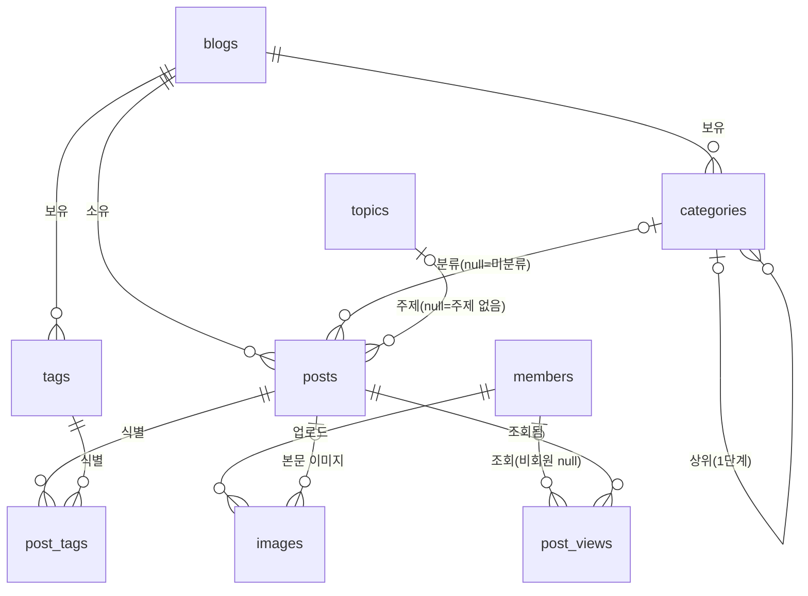

# ERD 파트 2 · 글·분류·검색 (민주)

기준: 통합 기능명세서 v0.2 6장, 'ERD 실습 파트 분담' 7장 컨벤션(MySQL, ERDCloud).
맡는 기능: POST-01~13, CAT-01~05, TAG-01~04, SRCH-01~02 (24개)

## 1. 엔티티 한눈에 보기

| 논리 이름 | 물리 이름 | 관련 기능 | 설명 |
| --- | --- | --- | --- |
| 글 | posts | POST-01~13, SRCH-01·02 | 파트 2의 중심. 파트 1·3이 가장 많이 참조한다 |
| 카테고리 | categories | CAT-01~05 | 블로그 안 분류. 자기 참조로 하위 한 단계 |
| 태그 | tags | TAG-01~04 | 블로그 단위 키워드 |
| 글-태그 | post_tags | TAG-01·02 | 글과 태그의 N:M 연결 |
| 주제 | topics | POST-11 | 플랫폼이 정한 큰 분류(7.7 글마다) |
| 이미지 | images | POST-05·07 | 본문·대표 이미지 업로드 기록 |
| 조회 기록 | post_views | POST-09, (HOME-02·MNG-03) | 1시간 인기 글(7.6) 집계용 |

다른 파트 엔티티(ERDCloud에는 상자만 두고 관계선을 잇는다): 회원 `members`(1), 블로그 `blogs`(1), 구독 `subscriptions`(3)

## 2. 테이블 명세

속성 순서는 기본키 → 외래키 → 일반 속성 → 상태 → 공통 시각(created_at → updated_at → deleted_at → hidden_at)이다.

### 2.1 글 · posts

| 논리 이름 | 물리 이름 | 타입 | NULL | 키 | 코멘트 |
| --- | --- | --- | --- | --- | --- |
| 글 ID | id | BIGINT | N | PK | 플랫폼 전체에서 유일한 글 번호(7.5). 글 주소에 쓴다 |
| 블로그 ID | blog_id | BIGINT | N | FK | 블로그 이사(BLOG-06) 때 바뀐다 |
| 카테고리 ID | category_id | BIGINT | Y | FK | NULL이면 미분류 |
| 주제 ID | topic_id | BIGINT | Y | FK | NULL이면 주제 없음(7.7 글마다) |
| 제목 | title | VARCHAR(100) | N | | 발행 시 1~100자. 임시저장은 빈 문자열 허용 |
| 본문 | content | LONGTEXT | N | | HTML(7.4 WYSIWYG). 스크립트 제거 후 저장 |
| 대표 이미지 URL | thumbnail_url | VARCHAR(500) | Y | | NULL이면 본문 첫 이미지(POST-07) |
| 공개 범위 | visibility | VARCHAR(20) | N | | PUBLIC / PRIVATE / SUBSCRIBERS (7.8). 기본 PUBLIC |
| 댓글 허용 여부 | is_comment_allowed | BOOLEAN | N | | 기본 TRUE (CMT-07, 파트 3 기능) |
| 조회 수 | view_count | INT | N | | 누적 조회 수(POST-09). 기본 0 |
| 예약 일시 | scheduled_at | DATETIME | Y | | 예약 발행 시각(POST-13) |
| 발행 일시 | published_at | DATETIME | Y | | 처음 실제로 공개된 시각. 수정해도 불변. 목록 정렬 기준(4.4) |
| 글 상태 | status | VARCHAR(20) | N | | DRAFT / SCHEDULED / PUBLISHED |
| 생성 일시 | created_at | DATETIME | N | | 발행 시각이 같을 때 정렬 보조 기준 |
| 수정 일시 | updated_at | DATETIME | N | | |
| 숨김 일시 | hidden_at | DATETIME | Y | | 서비스 관리자 숨김(ADMIN-03) |

- **상태와 공개 범위는 다른 축이다.** `status`는 발행 단계, `visibility`는 발행 후 누가 보느냐다. `SCHEDULED`는 공개 범위와 상관없이 주인에게만 보인다(4.1 ⑥).
- 인덱스: `(blog_id, status, published_at)` 블로그 메인·이전/다음 글, `(topic_id, published_at)` 홈 주제별 글, `(category_id, published_at)` 카테고리 목록, `FULLTEXT(title, content) WITH PARSER ngram` 검색(SRCH-01·02, 한글 대응).

### 2.2 카테고리 · categories

| 논리 이름 | 물리 이름 | 타입 | NULL | 키 | 코멘트 |
| --- | --- | --- | --- | --- | --- |
| 카테고리 ID | id | BIGINT | N | PK | |
| 블로그 ID | blog_id | BIGINT | N | FK | |
| 상위 카테고리 ID | parent_id | BIGINT | Y | FK | NULL이면 최상위. 한 단계까지만(CAT-03) |
| 이름 | name | VARCHAR(20) | N | | 1~20자(4.5 기준안). 같은 상위 안에서 유일 |
| 정렬 순서 | sort_order | INT | N | | CAT-04 |
| 비공개 여부 | is_private | BOOLEAN | N | | CAT-05. 기본 FALSE |
| 생성 일시 | created_at | DATETIME | N | | |
| 수정 일시 | updated_at | DATETIME | N | | |

- **'미분류'와 '전체 글'은 행으로 만들지 않는다.** 새 블로그는 카테고리 없이 시작하고(CAT-01 ④), 미분류는 `posts.category_id IS NULL`, 전체 글은 블로그의 모든 글이다. 이름 변경·삭제 금지 규칙은 행이 없으니 자연히 지켜진다.
- 삭제 동작을 FK로 표현한다: 카테고리 삭제 → 글은 `SET NULL`(미분류로 이동), 하위가 있는 상위 삭제 → `RESTRICT`(먼저 옮기라고 안내, CAT-03 ②).
- 주의: MySQL 유니크 키는 NULL을 서로 다른 값으로 보므로 `(blog_id, parent_id, name)` 유니크만으로는 **최상위 카테고리 이름 중복을 못 막는다.** 애플리케이션에서 검사하거나, 생성 열 `parent_key = IFNULL(parent_id, 0)`을 두고 `(blog_id, parent_key, name)`에 유니크를 건다.

### 2.3 태그 · tags

| 논리 이름 | 물리 이름 | 타입 | NULL | 키 | 코멘트 |
| --- | --- | --- | --- | --- | --- |
| 태그 ID | id | BIGINT | N | PK | |
| 블로그 ID | blog_id | BIGINT | N | FK | 태그는 블로그 단위(TAG-01 ②) |
| 이름 | name | VARCHAR(30) | N | | 블로그 안에서 유일. 길이는 명세에 없어 임시값 |
| 생성 일시 | created_at | DATETIME | N | | |
| 수정 일시 | updated_at | DATETIME | N | | 이름 변경(TAG-04) |

### 2.4 글-태그 · post_tags

| 논리 이름 | 물리 이름 | 타입 | NULL | 키 | 코멘트 |
| --- | --- | --- | --- | --- | --- |
| 글 ID | post_id | BIGINT | N | PK, FK | 식별 관계 |
| 태그 ID | tag_id | BIGINT | N | PK, FK | 식별 관계. 글당 최대 10개(앱에서 검사) |
| 생성 일시 | created_at | DATETIME | N | | |

- 글 삭제·태그 삭제 모두 `CASCADE`로 연결만 끊는다(4.7).

### 2.5 주제 · topics

| 논리 이름 | 물리 이름 | 타입 | NULL | 키 | 코멘트 |
| --- | --- | --- | --- | --- | --- |
| 주제 ID | id | BIGINT | N | PK | |
| 이름 | name | VARCHAR(20) | N | UK | IT, 여행 등 |
| 정렬 순서 | sort_order | INT | N | | |
| 생성 일시 | created_at | DATETIME | N | | |
| 수정 일시 | updated_at | DATETIME | N | | |

### 2.6 이미지 · images

| 논리 이름 | 물리 이름 | 타입 | NULL | 키 | 코멘트 |
| --- | --- | --- | --- | --- | --- |
| 이미지 ID | id | BIGINT | N | PK | |
| 회원 ID | member_id | BIGINT | N | FK | 올린 회원 |
| 글 ID | post_id | BIGINT | Y | FK | 글 저장 전에 올리면 NULL. 글 삭제 시 SET NULL 후 정리 |
| URL | url | VARCHAR(500) | N | | |
| 파일 유형 | content_type | VARCHAR(20) | N | | image/jpeg / image/png / image/gif / image/webp (4.6) |
| 파일 크기 | file_size | INT | N | | 바이트 |
| 생성 일시 | created_at | DATETIME | N | | |

### 2.7 조회 기록 · post_views

| 논리 이름 | 물리 이름 | 타입 | NULL | 키 | 코멘트 |
| --- | --- | --- | --- | --- | --- |
| 조회 기록 ID | id | BIGINT | N | PK | |
| 글 ID | post_id | BIGINT | N | FK | |
| 회원 ID | member_id | BIGINT | Y | FK | 비회원이면 NULL |
| 방문자 키 | viewer_key | VARCHAR(64) | N | | 비회원 구분용(쿠키 등). 중복 조회 판단(9.2) |
| 생성 일시 | created_at | DATETIME | N | | 조회한 시각. 인덱스 `(created_at, post_id)` |

- 7.6 '최근 1시간 조회수, 정각 집계'는 `created_at`이 직전 1시간 안인 행을 `post_id`별로 세면 된다. 집계 결과를 저장할지는 파트 3이 정한다.
- 조회 한 건마다 행이 생기고 수정하지 않으므로 `updated_at`은 없다. 누적 조회 수는 `posts.view_count`에 따로 올려 목록에서 COUNT를 피한다.

## 3. 다른 파트와 맞출 것

연결 회의 때 이 표를 들고 간다.

| 상대 | 맞출 것 | 파트 2 제안 |
| --- | --- | --- |
| 1 | 회원·블로그 식별자 | `members.id`, `blogs.id` 모두 BIGINT. 파트 2는 `blog_id`, `member_id`로 참조 |
| 1 | 글 삭제 방식 | **실제 삭제**. 댓글·공감·저장·알림·글-태그는 FK `CASCADE`로 함께 사라짐(4.7). 사전 합의 항목 |
| 1 | 숨김 사유 | 파트 2는 `hidden_at`만 둔다. 사유는 파트 1의 제재 기록에서 가져온다(MNG-01 ③에서 글쓴이에게 사유 표시) |
| 1 | 블로그 이사 후 옛 글 주소 | 글 번호가 전역이라 글 자체는 그대로다. 다만 '이 글이 옛 블로그에서 옮겨 왔는지'를 알아야 404 대신 이동시킬 수 있다(4.3 ②). 파트 1에 글 이사 기록(`post_moves`: post_id, from_blog_id) 요청 |
| 1 | 블로그 이사 시 태그 | **명세에 없음.** 태그는 블로그 단위인데 글이 다른 블로그로 가면 옛 블로그 태그를 가리키게 된다. 제안: 새 블로그에서 같은 이름의 태그로 다시 연결(없으면 생성) |
| 1 | 블로그 삭제 시 카테고리·태그 | 블로그는 소프트 삭제라 함께 남는다. 글만 숨김 대상(BLOG-07 ①) |
| 1 | 통합 검색(SRCH-02)의 블로그 검색 | `blogs.name`, `blogs.description`에 FULLTEXT(ngram) 인덱스 요청 |
| 3 | 구독자 공개(7.8) | 볼 수 있음 = 블로그 주인이거나 `subscriptions`에 (보는 회원, `posts.blog_id`) 행이 있음. 파트 3의 구독 PK가 (회원 ID, 블로그 ID)인지 확인 |
| 3 | 1시간 인기 글(7.6) | `post_views.created_at`으로 집계 가능. 집계 결과 저장 테이블은 파트 3 |
| 3 | 주제별 글(HOME-03) | `posts.topic_id`로 모은다 |
| 3 | 댓글 허용 여부 | 기능은 CMT-07(파트 3)이지만 글의 속성이라 `posts.is_comment_allowed`로 파트 2가 가진다 |
| 3 | 방문 통계의 인기 글(MNG-03 ②) | `post_views`를 기간으로 집계해서 쓸 수 있다 |

## 4. 기능 체크리스트

| 기능 | 담는 곳 |
| --- | --- |
| POST-01 작성·발행 | posts (content HTML, status) |
| POST-02 수정 | posts.updated_at, published_at 불변 |
| POST-03 삭제 | 실제 삭제 + CASCADE |
| POST-04 상세 조회 | 볼 수 있는지: blog 소속 → blogs 제한 → hidden_at → 주인 여부 → status·visibility·categories.is_private |
| POST-05 본문 이미지 | images |
| POST-06 공개·비공개 | posts.visibility |
| POST-07 대표 이미지 | posts.thumbnail_url |
| POST-08 임시저장 | posts.status = DRAFT |
| POST-09 조회수 | posts.view_count, post_views |
| POST-10 이전·다음 글 | (blog_id, published_at) 인덱스 |
| POST-11 주제 | topics, posts.topic_id |
| POST-12 구독자 공개 | visibility = SUBSCRIBERS + subscriptions(파트 3) |
| POST-13 예약 발행 | status = SCHEDULED, scheduled_at |
| CAT-01 추가·변경·삭제 | categories, FK SET NULL |
| CAT-02 카테고리별 목록 | categories.id + 하위 포함 조회 |
| CAT-03 하위 카테고리 | parent_id, FK RESTRICT |
| CAT-04 순서 | sort_order |
| CAT-05 비공개 | is_private |
| TAG-01 태그 달기 | tags, post_tags |
| TAG-02 태그별 목록 | post_tags |
| TAG-03 태그 목록 | tags (blog_id) |
| TAG-04 태그 관리 | tags.name 변경, 삭제 시 CASCADE |
| SRCH-01 블로그 내 검색 | FULLTEXT(title, content) + 태그 이름 |
| SRCH-02 통합 검색 | 위 + blogs FULLTEXT(파트 1) |

DDL은 `docs/erd_part2.sql`에 있다(MySQL 8).
