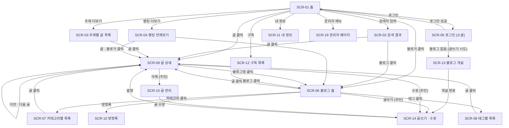

# 한채 기능명세서

## 문서 정보

| 항목 | 내용 |
| --- | --- |
| 문서명 | 한채 기능명세서 |
| 버전 | 0.6 (작성 중) |
| 작성자 | Minju |
| 최초 작성일 | 2026-10-02 |
| 최종 수정일 | 2026-10-03 |

### 변경 이력

| 버전 | 날짜 | 작성자 | 변경 내용 |
| --- | --- | --- | --- |
| 0.1 | 2026-10-02 | Minju | 개요 최초 작성 (블로그 플랫폼 기준) |
| 0.2 | 2026-10-03 | Minju | 문서 정보 · 변경 이력 추가, 회원가입을 소셜 로그인 방식으로 변경 |
| 0.3 | 2026-10-03 | Minju | 서비스 목적에 글 노출 방향 반영, 홈 화면 · 검색 기능 방향 정의, 화면 목록(6장) · 화면 흐름도(7장) 추가 |
| 0.4 | 2026-10-03 | Minju | 홈 화면 랭킹 기준 확정 (조회수, 최근 1시간, 정각 갱신), 주제는 티스토리 방식으로 결정 |
| 0.5 | 2026-10-03 | Minju | 용어 정의(2장) 추가 |
| 0.6 | 2026-10-03 | Minju | 기능 목록(8장) 추가 |

## 1. 개요

### 1.1 서비스 소개

| 항목 | 내용 |
| --- | --- |
| 서비스명 | 한채 |
| 한 줄 소개 | 누구나 자기 블로그를 열어 글을 쓰고 나누는 블로그 플랫폼 |
| 참고 서비스 | 티스토리 |
| 운영자 | Minju |
| 서비스 형태 | 웹 기반 블로그 플랫폼 (프론트엔드 + 백엔드 서버 + 데이터베이스) |

한채는 회원이 각자 자기 블로그를 열고 글을 쓰는 블로그 플랫폼이다. 티스토리처럼 블로그마다 주인이 있고, 블로그마다 이름, 주소, 카테고리, 글을 따로 가진다. 방문자는 메인 화면에서 여러 블로그의 글을 둘러보고, 마음에 드는 블로그를 구독하거나 글에 댓글과 공감을 남길 수 있다.

서비스 전체에 한옥 테마를 입혀, 대문이 열리는 랜딩 화면 같은 연출로 다른 블로그 서비스와 차별점을 둔다.

### 1.2 서비스 목적

- **나만의 기록 공간:** 회원이 자기 블로그에 글을 카테고리와 태그로 분류해 쌓는다.
- **블로그 간 소통:** 댓글, 공감, 구독, 방명록으로 블로거끼리 교류한다.
- **글 노출과 발견:** 블로그의 핵심은 많은 글이 많은 사람에게 보이는 것이다. 홈 화면에서 인기 글, 인기 블로거, 주제별 글을 최대한 많이 보여 주고, 검색으로 원하는 글을 직접 찾을 수 있게 한다.
- **테마가 있는 경험:** 한옥 테마로 기존 블로그 서비스와 다른 분위기를 준다.

### 1.3 문서 목적

이 문서는 한채의 각 기능이 **어떤 화면에서, 누가, 어떻게 사용하며, 어떤 결과를 내는지**를 정의한다.

- 프론트엔드와 백엔드를 개발할 때 구현 기준으로 쓴다.
- 기능이 명세대로 동작하는지 확인하는 테스트 기준으로 쓴다.
- 이후 기능을 추가하거나 바꿀 때 참고 자료로 쓴다.

### 1.4 대상 사용자

| 사용자 | 설명 |
| --- | --- |
| 방문자 | 로그인하지 않고 글과 블로그를 둘러보는 사용자 |
| 회원 | 소셜 계정으로 가입하고 로그인한 사용자. 댓글, 공감, 구독을 할 수 있다 |
| 블로그 주인 | 자기 블로그를 개설한 회원. 자기 블로그의 글, 카테고리, 댓글, 설정을 관리한다 |
| 서비스 관리자 | 한채 운영자. 회원과 게시물을 관리하고 신고를 처리한다 |

> 역할별 상세 권한은 "5. 사용자 · 권한"에서 정의한다.

### 1.5 기술 환경 요약

| 구분 | 내용 |
| --- | --- |
| 프론트엔드 | HTML, CSS, JavaScript |
| 백엔드 | Python (프레임워크 미정) |
| 데이터베이스 | 미정 (처음 다루기 쉬운 것으로 선택 예정) |
| 인증 | 소셜 로그인 (OAuth 2.0). 제공사(카카오, 구글, 네이버 등)는 미정 |

> 상세 기술 스택과 실행 환경은 "4. 시스템 환경"에서 정의한다.

### 1.6 범위

**포함 범위**

| 영역 | 내용 |
| --- | --- |
| 회원 | 소셜 로그인(최초 로그인 시 자동 가입), 로그아웃, 회원 정보 수정, 탈퇴 |
| 블로그 개설 · 설정 | 블로그 만들기, 블로그 이름 · 주소 · 소개 · 프로필 이미지 설정 |
| 홈 화면 | 실시간 인기 글 랭킹, 인기 블로거 랭킹, 주제별 글, 최신 글을 한 화면에 노출 (랜딩 페이지는 홈으로 통합 예정) |
| 블로그 화면 | 블로그별 글 목록, 카테고리, 태그, 사이드바 |
| 글 | 글 보기, 글쓰기, 수정, 삭제, 임시 저장, 공개 · 비공개 설정 |
| 에디터 | 서식, 이미지 업로드, 링크, 코드 블록 |
| 카테고리 · 태그 | 블로그별 카테고리 관리, 글에 태그 달기, 카테고리 · 태그별 글 목록 |
| 검색 | 전체 글 검색(제목 · 본문 · 태그), 블로그 검색, 블로그 안에서 검색 |
| 소통 | 댓글, 공감, 구독, 방명록 |
| 블로그 관리 | 내 글 관리, 댓글 관리, 방문 통계 |
| 서비스 관리 | 회원 관리, 게시물 관리, 신고 처리 |

**제외 범위**

- 광고 · 수익화 기능 (티스토리의 애드센스 연동 등)
- 결제
- 이메일 · 비밀번호 직접 가입 (비밀번호 저장, 비밀번호 찾기 포함)
- 이메일 · 푸시 알림
- 스킨 HTML · CSS 직접 편집, 개인 도메인 연결
- 모바일 앱

### 1.7 참고 문서

| 문서 | 설명 |
| --- | --- |
| 포트폴리오 블로그 서비스 요구사항 명세서 (2026-10-01) | 1인 정적 블로그 버전의 요구사항 정리본 |
| 티스토리 | 기능 구성과 화면 흐름 참고 |

---

## 2. 용어 정의

이 문서에서 쓰는 용어의 뜻을 하나로 고정한다. 같은 말을 문서마다 다르게 쓰지 않도록, 이후 장에서는 아래 표현만 쓴다.

### 2.1 사용자

| 용어 | 정의 | 비고 |
| --- | --- | --- |
| 방문자 | 로그인하지 않고 서비스를 이용하는 사용자 | 글 읽기, 검색, 랭킹 보기만 가능 |
| 회원 | 소셜 계정으로 로그인해 한채에 가입된 사용자 | 댓글, 공감, 구독, 방명록 작성 가능 |
| 블로그 주인 | 블로그를 개설한 회원. 자기 블로그의 글과 설정을 관리한다 | 회원의 한 종류다. 블로그 하나당 주인은 한 명 |
| 서비스 관리자 | 한채를 운영하는 사람 | 회원 · 게시물 관리, 신고 처리 |
| 소셜 로그인 | 카카오, 구글 같은 외부 서비스의 계정으로 로그인하는 방식 | 비밀번호를 한채가 저장하지 않는다 |
| 자동 가입 | 소셜 로그인을 처음 했을 때 별도 가입 절차 없이 회원이 만들어지는 것 | 가입 화면이 따로 없다 |

### 2.2 블로그와 글

| 용어 | 정의 | 비고 |
| --- | --- | --- |
| 블로그 | 회원이 개설한 개인 공간. 이름, 주소, 소개, 글, 카테고리를 가진다 | 혼동 주의: 서비스 전체는 "한채"라고 부른다 |
| 블로그 주소 | 블로그를 구분하는 고유한 영문 식별자 | URL의 `{blog}` 자리에 들어간다 |
| 블로그 개설 | 회원이 자기 블로그를 처음 만드는 것 | |
| 글 | 제목, 본문, 카테고리, 태그를 가진 블로그 게시물 | |
| 본문 | 에디터로 작성한 글의 내용(HTML) | |
| 발행 | 글을 저장해 다른 사람이 볼 수 있게 하는 것 | 공개 글만 홈, 검색, 랭킹에 노출된다 |
| 공개 · 비공개 | 공개는 누구나 볼 수 있고, 비공개는 블로그 주인만 볼 수 있다 | 비공개 글은 검색 · 랭킹에서 제외 |
| 임시 저장 | 발행하지 않고 작성 중인 글을 저장해 두는 것 | 블로그 주인에게만 보인다 |
| 썸네일 | 목록에서 글을 대표하는 작은 이미지 | 본문의 첫 이미지를 쓴다. 없으면 기본 이미지 |
| 조회수 | 글이 열린 횟수 | 랭킹 계산의 기준이 된다 |
| 에디터 | 글을 쓰는 편집 화면. 서식을 눈으로 보며 편집하는(WYSIWYG) 방식 | |
| 새니타이즈 | 본문 HTML에서 허용한 태그와 속성만 남기고 위험한 코드를 지우는 처리 | |

### 2.3 분류

세 가지 분류는 서로 다른 개념이다.

| 용어 | 누가 정하는가 | 정의 | 개수 |
| --- | --- | --- | --- |
| 주제 | 서비스 | 서비스 전체에서 글을 묶는 큰 분류 (티스토리 방식). 홈의 주제별 글에 쓰인다 | 서비스가 정한 목록에서 선택 |
| 카테고리 | 블로그 주인 | 한 블로그 안에서 글을 정리하는 분류. 비우면 "미분류" | 글 하나에 하나 |
| 태그 | 글쓴이 | 글 하나에 붙이는 키워드. 검색에 쓰인다 | 글 하나에 여러 개 |

> 주제를 블로그마다 정할지 글마다 정할지는 아직 정하지 않았다. (6.3 남은 미결 사항)

### 2.4 소통

| 용어 | 정의 | 비고 |
| --- | --- | --- |
| 댓글 | 글 아래에 회원이 남기는 의견 | |
| 공감 | 글에 대한 좋아요. 회원이 글마다 한 번 누를 수 있다 | |
| 구독 | 회원이 마음에 드는 블로그의 새 글을 모아 보려고 등록하는 것 | 블로그 단위로 한다 |
| 방명록 | 방문한 회원이 블로그 주인에게 남기는 글 | 특정 글이 아니라 블로그에 남긴다 |

### 2.5 홈 화면 · 탐색

| 용어 | 정의 | 비고 |
| --- | --- | --- |
| 홈 | 서비스의 첫 화면. 여러 블로그의 글을 한곳에 모아 보여 준다 | 블로그 홈과 구분한다 |
| 블로그 홈 | 개별 블로그의 첫 화면(글 목록) | |
| 랭킹 | 조회수 기준으로 매긴 순위 | 글 랭킹과 블로거 랭킹이 있다 |
| 인기 글 | 최근 1시간 동안 조회수가 많은 글 | |
| 인기 블로거 | 최근 1시간 동안 그 블로그 글들의 조회수 합계가 많은 블로거 | 가정 (확인 필요) |
| 집계 | 조회 기록을 모아 순위를 계산하는 작업. 정각마다 실행한다 | |
| 검색 | 검색어로 글(제목 · 본문 · 태그)과 블로그(이름 · 소개)를 찾는 기능 | |

### 2.6 기술 · 문서 표기

| 용어 | 정의 |
| --- | --- |
| OAuth 2.0 | 외부 서비스의 계정으로 로그인하게 해 주는 표준 방식. 소셜 로그인에 쓴다 |
| 예약 작업 | 정해진 시각에 서버가 자동으로 실행하는 작업 (예: 정각 집계) |
| 화면 ID `SCR-nn` | 화면 목록의 화면 번호 |
| 기능 ID `FR-nn` | 기능 요구사항 번호 (기능 목록에서 부여) |
| 비기능 ID `NFR-nn` | 비기능 요구사항 번호 |
| 메시지 ID `MSG-nn` | 화면에 나오는 안내 · 오류 문구 번호 |

> 3~5장(시스템 환경, 사용자 · 권한 등)은 작성 예정이다. 장 번호는 최종 목차 기준으로 미리 매겼다.

## 6. 화면 목록

### 6.1 설계 방향

- **홈 화면이 서비스의 첫 화면이다.** 로그인하지 않은 방문자도 바로 홈에 들어와 글을 볼 수 있다. 글을 읽게 만드는 것이 목적이므로, 글보다 연출이 앞서는 랜딩 페이지는 두지 않는다.
- **기존 랜딩 페이지(대문 열기 연출)는 개편 예정이다.** 목업으로 만든 상태이며, 한옥 테마 연출은 홈 화면의 디자인 요소로 옮기는 방향을 검토한다. (SCR-00)
- **홈 화면은 티스토리처럼 여러 종류의 글을 한 화면에 보여 준다.** 실시간 글 랭킹, 인기 블로거 랭킹, 주제별 글, 최신 글을 모두 노출한다.
- **검색은 모든 화면의 헤더에서 쓸 수 있다.** 사용자가 직접 글을 찾을 수 있게 한다.

### 6.2 화면 목록

URL은 백엔드 라우팅을 정할 때 바뀔 수 있는 **초안**이다. `{blog}`는 블로그 주소, `{id}`는 글 번호를 뜻한다.

#### 공통 · 탐색

| 화면 ID | 화면명 | URL (초안) | 접근 권한 | 설명 | 상태 |
| --- | --- | --- | --- | --- | --- |
| SCR-00 | 랜딩 (대문) | `/` 기존 목업 | 모두 | 대문 열기 연출 화면. 홈으로 통합하거나 제거할 예정 | 개편 예정 |
| SCR-01 | 홈 | `/` | 모두 | 서비스 첫 화면. 랭킹, 주제별 글, 최신 글 노출 (6.3 참고) | 신규 |
| SCR-02 | 검색 결과 | `/search?q=검색어` | 모두 | 글 · 블로그 검색 결과 (6.4 참고) | 신규 |
| SCR-03 | 주제별 글 목록 | `/topic/{name}` | 모두 | 한 주제(예: 개발, 일상)의 글 모아 보기 | 신규 |
| SCR-04 | 랭킹 전체보기 | `/ranking` | 모두 | 인기 글 · 인기 블로거 순위 전체. 탭으로 전환 | 신규 |
| SCR-05 | 로그인 | `/login` | 방문자 | 소셜 로그인 버튼. 처음이면 자동 가입 | 신규 |

#### 블로그 (방문자가 보는 화면)

| 화면 ID | 화면명 | URL (초안) | 접근 권한 | 설명 | 상태 |
| --- | --- | --- | --- | --- | --- |
| SCR-06 | 블로그 홈 (글 목록) | `/{blog}` | 모두 | 블로그의 전체 글 목록, 페이지네이션, 사이드바 | 기존 목업(blog.html) 수정 |
| SCR-07 | 블로그 카테고리별 목록 | `/{blog}/category/{name}` | 모두 | 블로그 안의 카테고리별 글 | 신규 |
| SCR-08 | 블로그 태그별 목록 | `/{blog}/tag/{name}` | 모두 | 블로그 안의 태그별 글 | 신규 |
| SCR-09 | 글 상세 | `/{blog}/{id}` | 모두 (비공개 글은 주인만) | 글 보기, 공감, 댓글, 이전 · 다음 글 | 기존 목업(post.html) 수정 |
| SCR-10 | 방명록 | `/{blog}/guestbook` | 모두 (작성은 회원) | 방문자가 블로그 주인에게 글을 남김 | 신규 |

#### 회원

| 화면 ID | 화면명 | URL (초안) | 접근 권한 | 설명 | 상태 |
| --- | --- | --- | --- | --- | --- |
| SCR-11 | 내 정보 | `/me` | 회원 | 닉네임, 프로필 수정, 탈퇴 | 신규 |
| SCR-12 | 구독 목록 | `/me/subscriptions` | 회원 | 내가 구독한 블로그와 새 글 | 신규 |
| SCR-13 | 블로그 개설 | `/blog/new` | 회원 (블로그 없는 사람) | 블로그 이름, 주소, 소개 입력 | 신규 |

#### 블로그 관리 (블로그 주인)

| 화면 ID | 화면명 | URL (초안) | 접근 권한 | 설명 | 상태 |
| --- | --- | --- | --- | --- | --- |
| SCR-14 | 글쓰기 · 수정 | `/manage/write?id=` | 블로그 주인 | 에디터, 카테고리 · 태그, 공개 설정, 발행 | 기존 목업(admin/write.html) 수정 |
| SCR-15 | 글 관리 | `/manage/posts` | 블로그 주인 | 내 글 목록, 수정 · 삭제, 공개 전환 | 신규 |
| SCR-16 | 댓글 관리 | `/manage/comments` | 블로그 주인 | 내 블로그의 댓글 확인 · 삭제 | 신규 |
| SCR-17 | 카테고리 관리 | `/manage/categories` | 블로그 주인 | 카테고리 추가 · 이름 변경 · 순서 변경 · 삭제 | 신규 |
| SCR-18 | 블로그 설정 | `/manage/settings` | 블로그 주인 | 블로그 이름 · 소개 · 프로필 이미지 | 신규 |

#### 서비스 관리 · 기타

| 화면 ID | 화면명 | URL (초안) | 접근 권한 | 설명 | 상태 |
| --- | --- | --- | --- | --- | --- |
| SCR-19 | 관리자 페이지 | `/admin` | 서비스 관리자 | 회원 · 게시물 관리, 신고 처리 | 신규 |
| SCR-20 | 오류 화면 | 404, 403 등 | 모두 | 없는 페이지, 권한 없음 안내 | 신규 |

> 방문 통계, 신고 접수 화면은 개요의 2차 범위 후보라서 위 표에서 뺐다. 범위가 정해지면 추가한다.

### 6.3 홈 화면(SCR-01) 구성

홈 화면은 위에서 아래로 영역을 쌓아, 한 번 들어온 사람이 여러 글을 눌러 볼 수 있게 한다.

| 영역 | 보여 주는 내용 | 목적 |
| --- | --- | --- |
| 헤더 | 로고, 검색창, 로그인 또는 닉네임 · 내 블로그 바로가기 | 어디서든 검색하고 로그인 |
| 실시간 인기 글 | 최근 1시간 동안 조회수가 많은 글 순위 (제목, 블로그명, 썸네일). 정각마다 갱신 | 지금 많이 읽히는 글 노출 |
| 인기 블로거 | 최근 1시간 동안 블로그 글 조회수 합계가 많은 블로거 순위. 정각마다 갱신 | 어떤 블로거가 인기인지 알림, 구독 유도 |
| 주제별 글 | 주제 탭(서비스가 정한 주제 목록)을 바꾸면 해당 주제의 글을 몇 개씩 보여 줌 | 관심사별로 다양한 글 노출 |
| 최신 글 | 방금 올라온 공개 글 목록 | 신규 글에도 노출 기회 제공 |
| 푸터 | 서비스 정보, 저작권 | |

**결정 사항**

| 항목 | 결정 | 비고 |
| --- | --- | --- |
| 랭킹 점수 기준 | **조회수** | 처음에는 조회수만 사용한다. 공감 · 댓글 가중치는 이후 확장 후보 |
| 랭킹 집계 기간 | **최근 1시간** | 정각 기준 직전 60분의 조회수를 집계한다 |
| 랭킹 갱신 방식 | **정각마다 계산해 저장** | 서버가 매 정각에 집계하고 결과를 저장해 둔다. 다음 정각까지는 같은 순위를 보여 준다 |
| 주제 | **티스토리 방식** | 서비스가 정한 주제 목록을 쓴다. 블로그 카테고리와는 별개 개념이다 |
| 노출 개수 | **디자인 후 결정** | 영역별 노출 글 수는 홈 화면 디자인이 끝난 뒤 정한다 |

**결정에 따라 생기는 구현 조건**

- 조회가 일어난 시각을 기록해야 한다. 조회수 숫자 하나만으로는 "최근 1시간"을 셀 수 없다. (데이터 정의에서 조회 기록 구조를 정한다)
- 매 정각에 집계를 실행하는 예약 작업이 서버에 필요하다.
- 인기 블로거 순위는 "그 블로그 글들의 최근 1시간 조회수 합계"로 가정했다. (확인 필요)

**남은 미결 사항**

| 항목 | 내용 |
| --- | --- |
| 주제 목록 | 티스토리의 주제 목록을 어떻게 가져올지 정해야 한다 (전체 사용 / 줄여서 사용) |
| 주제 지정 단위 | 블로그마다 주제를 하나 정할지, 글마다 고를지 |
| 조회수 중복 처리 | 새로고침으로 조회수를 올리는 것을 막을지 (랭킹에 직접 영향) |
| 최근 1시간 조회가 없을 때 | 글이 적은 초기에는 순위가 비거나 동점이 많다. 비었을 때 보여 줄 대체 기준 (예: 최근 24시간, 누적 조회수) |

### 6.4 검색(SCR-02) 구성

| 항목 | 내용 |
| --- | --- |
| 진입 | 모든 화면 헤더의 검색창에서 검색어를 입력하고 Enter |
| 검색 대상 | 글(제목 · 본문 · 태그), 블로그(이름 · 소개) |
| 결과 구성 | "글" 탭과 "블로그" 탭. 결과 개수 표시 |
| 정렬 | 정확도순, 최신순 |
| 결과 없음 | 안내 문구와 인기 글 추천 노출 |
| 범위 제한 | 비공개 글은 결과에서 제외한다 |
| 블로그 안 검색 | 블로그 화면의 검색창은 그 블로그의 글만 검색한다 |

## 7. 화면 흐름도

### 7.1 전체 흐름

> 노션에서는 코드 블록 언어를 `Mermaid`로 지정하면 그림으로 보인다.

### 7.2 이동 규칙

| 출발 화면 | 행동 | 도착 화면 | 조건 |
| --- | --- | --- | --- |
| 모든 화면 | 헤더 검색창에서 검색 | SCR-02 | 없음 |
| SCR-01 | 글 카드 클릭 | SCR-09 | 없음 |
| SCR-01 | "더보기" 클릭 | SCR-03, SCR-04 | 없음 |
| SCR-05 | 소셜 로그인 성공 | 로그인 직전 화면 | 직전 화면이 없으면 SCR-01 |
| SCR-05 | 최초 로그인 | 자동 가입 후 로그인 직전 화면 | 가입 별도 화면 없음 |
| 모든 화면 | 글쓰기 클릭 | SCR-14 | 로그인 + 블로그 있음 |
| 모든 화면 | 글쓰기 클릭 | SCR-05 | 로그인하지 않음 |
| 모든 화면 | 글쓰기 클릭 | SCR-13 | 로그인했지만 블로그 없음 |
| SCR-14 | 발행 | SCR-09 | 제목 · 본문 입력 완료 |
| SCR-09 | 삭제 | SCR-15 | 확인 창에서 확인 |
| SCR-09, SCR-10 | 댓글 · 공감 · 방명록 작성 | SCR-05 | 로그인하지 않음 |
| SCR-11~18 | 접근 | SCR-05 | 로그인하지 않음 |
| SCR-14~18 | 접근 | SCR-20 (403) | 블로그 주인이 아님 |
| SCR-19 | 접근 | SCR-20 (403) | 서비스 관리자가 아님 |
| 모든 화면 | 없는 주소 접근 | SCR-20 (404) | 없는 글, 블로그, 주제 |

### 7.3 로그인 흐름

로그인 화면을 따로 거치지 않아도 되는 경우(구경만 하는 경우)와 로그인이 꼭 필요한 경우를 나눈다.

| 구분 | 행동 | 로그인 필요 |
| --- | --- | --- |
| 필요 없음 | 홈, 검색, 랭킹, 블로그, 글 읽기 | X |
| 필요함 | 댓글, 공감, 구독, 방명록 작성 | O |
| 필요함 | 블로그 개설, 글쓰기 · 수정 · 삭제, 블로그 관리 | O (블로그 주인) |
| 필요함 | 서비스 관리 | O (서비스 관리자) |

## 8. 기능 목록

화면별로 필요한 기능을 한곳에 모은 요약표다. 각 기능의 동작은 9장 "기능 상세"에서 하나씩 정의한다.

전체 **44개**이며, 1차 35개, 2차 9개로 나눴다.

### 8.1 표 보는 법

| 항목 | 설명 |
| --- | --- |
| ID | `FR-nn`. 기능 상세와 테스트에서 이 번호로 가리킨다 |
| 우선순위 | 상: 없으면 서비스가 성립하지 않음 / 중: 있어야 쓸 만함 / 하: 있으면 좋음 |
| 단계 | 1차: 먼저 만들 범위 / 2차: 1차가 끝난 뒤 만들 범위 (**제안**, 확정 아님) |
| 목업 | ○: 기존 목업(localStorage 버전)에 비슷한 기능이 있음. 백엔드 · DB 연동으로 다시 만들어야 한다 |

### 8.2 회원 · 인증

| ID | 기능명 | 설명 | 관련 화면 | 액터 | 우선순위 | 단계 | 목업 |
| --- | --- | --- | --- | --- | --- | --- | --- |
| FR-01 | 소셜 로그인 | 소셜 계정으로 로그인한다. 처음이면 자동 가입된다 | SCR-05 | 방문자 | 상 | 1차 |  |
| FR-02 | 로그아웃 | 로그아웃하고 로그인 전 상태로 돌아간다 | 공통(헤더) | 회원 | 상 | 1차 | ○ |
| FR-03 | 내 정보 수정 | 닉네임, 프로필 이미지를 수정한다 | SCR-11 | 회원 | 중 | 1차 |  |
| FR-04 | 회원 탈퇴 | 계정을 삭제한다. 내 블로그와 글의 처리 방식을 정해야 한다 | SCR-11 | 회원 | 중 | 2차 |  |

### 8.3 블로그

| ID | 기능명 | 설명 | 관련 화면 | 액터 | 우선순위 | 단계 | 목업 |
| --- | --- | --- | --- | --- | --- | --- | --- |
| FR-05 | 블로그 개설 | 이름, 주소, 소개를 입력해 내 블로그를 만든다. 회원당 1개 | SCR-13 | 회원 | 상 | 1차 |  |
| FR-06 | 블로그 설정 | 블로그 이름, 소개, 프로필 이미지를 수정한다 | SCR-18 | 블로그 주인 | 중 | 1차 |  |
| FR-07 | 블로그 글 목록 | 블로그의 공개 글을 최신순으로 보여 주고 페이지를 나눈다 | SCR-06 | 모두 | 상 | 1차 | ○ |
| FR-08 | 블로그 사이드바 | 프로필, 카테고리별 글 수, 최근 글, 인기 글, 태그를 보여 준다 | SCR-06~10 | 모두 | 중 | 1차 | ○ |

### 8.4 글 읽기

| ID | 기능명 | 설명 | 관련 화면 | 액터 | 우선순위 | 단계 | 목업 |
| --- | --- | --- | --- | --- | --- | --- | --- |
| FR-09 | 글 상세 보기 | 카테고리, 제목, 작성일, 조회수, 본문, 태그를 보여 준다 | SCR-09 | 모두 | 상 | 1차 | ○ |
| FR-10 | 조회수 증가 · 조회 기록 | 글을 열 때 조회수를 올리고 조회 시각을 기록한다 (랭킹 집계에 사용) | SCR-09 | 모두 | 상 | 1차 | ○ |
| FR-11 | 이전 · 다음 글 | 같은 블로그에서 최신순으로 이전 글과 다음 글로 이동한다 | SCR-09 | 모두 | 중 | 1차 | ○ |
| FR-12 | 비공개 · 없는 글 처리 | 비공개 글은 주인만 볼 수 있고, 없는 글은 오류 화면을 보여 준다 | SCR-09 | 모두 | 상 | 1차 | ○ |

### 8.5 글쓰기 · 관리

| ID | 기능명 | 설명 | 관련 화면 | 액터 | 우선순위 | 단계 | 목업 |
| --- | --- | --- | --- | --- | --- | --- | --- |
| FR-13 | 글 작성 · 발행 | 제목, 본문을 입력해 발행하고 글 상세로 이동한다 | SCR-14 | 블로그 주인 | 상 | 1차 | ○ |
| FR-14 | 글 수정 | 기존 글을 불러와 고치고 다시 발행한다 | SCR-14 | 블로그 주인 | 상 | 1차 | ○ |
| FR-15 | 글 삭제 | 확인 후 글을 삭제한다 | SCR-09, SCR-15 | 블로그 주인 | 상 | 1차 | ○ |
| FR-16 | 에디터 서식 | 문단 형식, 굵게, 기울임, 글자색, 정렬, 목록, 인용, 코드 블록, 링크 등 | SCR-14 | 블로그 주인 | 상 | 1차 | ○ |
| FR-17 | 이미지 업로드 | 이미지를 서버에 올리고 본문에는 주소만 넣는다. 올릴 때 크기를 줄인다 | SCR-14 | 블로그 주인 | 중 | 1차 | ○ |
| FR-18 | 카테고리 · 태그 · 주제 지정 | 글에 카테고리(하나), 태그(여러 개), 주제를 지정한다 | SCR-14 | 블로그 주인 | 중 | 1차 | ○ |
| FR-19 | 공개 · 비공개 설정 | 발행할 때 공개 여부를 고른다 | SCR-14 | 블로그 주인 | 중 | 1차 |  |
| FR-20 | 임시 저장 | 발행하지 않고 작성 중인 글을 저장해 두고 이어 쓴다 | SCR-14 | 블로그 주인 | 하 | 2차 |  |
| FR-21 | 글 관리 목록 | 내 글을 목록으로 보고 수정, 삭제, 공개 전환을 한다 | SCR-15 | 블로그 주인 | 중 | 1차 |  |

### 8.6 카테고리 · 태그

| ID | 기능명 | 설명 | 관련 화면 | 액터 | 우선순위 | 단계 | 목업 |
| --- | --- | --- | --- | --- | --- | --- | --- |
| FR-22 | 카테고리 관리 | 카테고리를 추가, 이름 변경, 순서 변경, 삭제한다 | SCR-17 | 블로그 주인 | 중 | 1차 |  |
| FR-23 | 카테고리별 글 목록 | 블로그 안에서 한 카테고리의 글만 보여 준다 | SCR-07 | 모두 | 중 | 1차 |  |
| FR-24 | 태그별 글 목록 | 블로그 안에서 한 태그가 붙은 글만 보여 준다 | SCR-08 | 모두 | 중 | 1차 |  |

### 8.7 홈 · 탐색

| ID | 기능명 | 설명 | 관련 화면 | 액터 | 우선순위 | 단계 | 목업 |
| --- | --- | --- | --- | --- | --- | --- | --- |
| FR-25 | 홈 화면 구성 | 인기 글, 인기 블로거, 주제별 글, 최신 글을 한 화면에 보여 준다 | SCR-01 | 모두 | 상 | 1차 |  |
| FR-26 | 인기 글 랭킹 | 정각마다 최근 1시간 조회수로 글 순위를 계산해 저장하고 보여 준다 | SCR-01, SCR-04 | 모두 | 상 | 1차 |  |
| FR-27 | 인기 블로거 랭킹 | 정각마다 최근 1시간 조회수 합계로 블로거 순위를 계산해 저장하고 보여 준다 | SCR-01, SCR-04 | 모두 | 상 | 1차 |  |
| FR-28 | 주제별 글 목록 | 주제를 고르면 해당 주제의 공개 글을 보여 준다 | SCR-01, SCR-03 | 모두 | 중 | 1차 |  |
| FR-29 | 최신 글 노출 | 방금 올라온 공개 글을 보여 준다 | SCR-01 | 모두 | 상 | 1차 |  |
| FR-30 | 랭킹 전체보기 | 인기 글 · 인기 블로거 순위 전체를 탭으로 보여 준다 | SCR-04 | 모두 | 중 | 1차 |  |
| FR-31 | 통합 검색 | 검색어로 글(제목 · 본문 · 태그)과 블로그를 찾고 정렬한다 | SCR-02 | 모두 | 상 | 1차 |  |
| FR-32 | 블로그 안 검색 | 한 블로그의 글만 검색한다 | SCR-06 | 모두 | 중 | 2차 |  |

### 8.8 소통

| ID | 기능명 | 설명 | 관련 화면 | 액터 | 우선순위 | 단계 | 목업 |
| --- | --- | --- | --- | --- | --- | --- | --- |
| FR-33 | 공감 | 글에 공감을 누르고 취소한다. 회원당 글마다 한 번 | SCR-09 | 회원 | 중 | 1차 |  |
| FR-34 | 댓글 | 댓글을 쓰고, 내 댓글을 삭제한다 | SCR-09 | 회원 | 중 | 1차 |  |
| FR-35 | 구독 | 블로그를 구독하고 해제한다 | SCR-06, SCR-09 | 회원 | 중 | 2차 |  |
| FR-36 | 구독 목록 | 구독한 블로그와 새 글을 모아 본다 | SCR-12 | 회원 | 중 | 2차 |  |
| FR-37 | 방명록 | 블로그 주인에게 방명록을 남기고 삭제한다 | SCR-10 | 회원 | 하 | 2차 |  |
| FR-38 | 댓글 관리 | 내 블로그의 댓글을 모아 보고 삭제한다 | SCR-16 | 블로그 주인 | 하 | 2차 |  |

### 8.9 서비스 관리

| ID | 기능명 | 설명 | 관련 화면 | 액터 | 우선순위 | 단계 | 목업 |
| --- | --- | --- | --- | --- | --- | --- | --- |
| FR-39 | 회원 관리 | 회원 목록을 보고 이용을 제한한다 | SCR-19 | 서비스 관리자 | 하 | 2차 |  |
| FR-40 | 게시물 관리 | 부적절한 글을 숨기거나 삭제한다 | SCR-19 | 서비스 관리자 | 하 | 2차 |  |

### 8.10 공통

| ID | 기능명 | 설명 | 관련 화면 | 액터 | 우선순위 | 단계 | 목업 |
| --- | --- | --- | --- | --- | --- | --- | --- |
| FR-41 | 헤더 | 로고, 검색창, 로그인 또는 닉네임 · 내 블로그 · 글쓰기 바로가기를 보여 준다 | 공통 | 모두 | 상 | 1차 | ○ |
| FR-42 | 접근 제어 | 로그인이나 권한이 없으면 로그인 화면으로 보내거나 접근을 막는다 | 공통 | 모두 | 상 | 1차 |  |
| FR-43 | 모바일 메뉴 | 좁은 화면에서 사이드바를 서랍 메뉴로 연다 | SCR-06~10 | 모두 | 중 | 1차 | ○ |
| FR-44 | 오류 화면 | 없는 페이지(404), 권한 없음(403)을 안내한다 | SCR-20 | 모두 | 하 | 1차 |  |

### 8.11 이전 요구사항과의 차이

| 구분 | 내용 |
| --- | --- |
| 없어진 기능 | 대문 열기 연출 · 로그인 창(랜딩), 이메일 회원가입 · 비밀번호 로그인 |
| 달라진 기능 | 글쓰기 · 수정 · 삭제가 관리자 한 명 전용에서 **각 블로그 주인** 전용으로 바뀜 |
| 달라진 기능 | 이미지가 본문에 직접 들어가는 방식에서 서버 업로드 방식으로 바뀜 |
| 달라진 기능 | 조회수가 숫자 하나에서 조회 시각 기록으로 바뀜 (최근 1시간 랭킹 때문) |
| 새로 생긴 기능 | 홈 랭킹, 주제별 글, 블로그 개설 · 설정, 카테고리 관리, 구독, 서비스 관리 |

> 신고 접수 기능은 화면 목록에 없어서 이번 목록에서 뺐다. 범위에 넣기로 하면 화면과 기능을 함께 추가한다.
