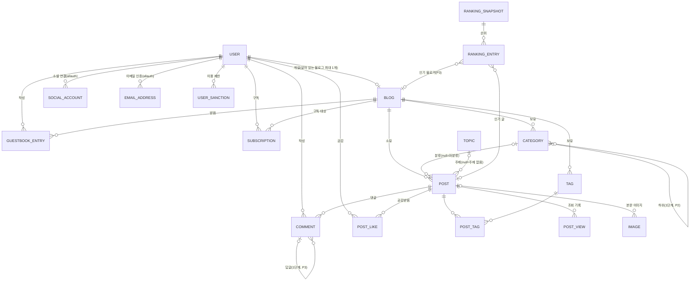
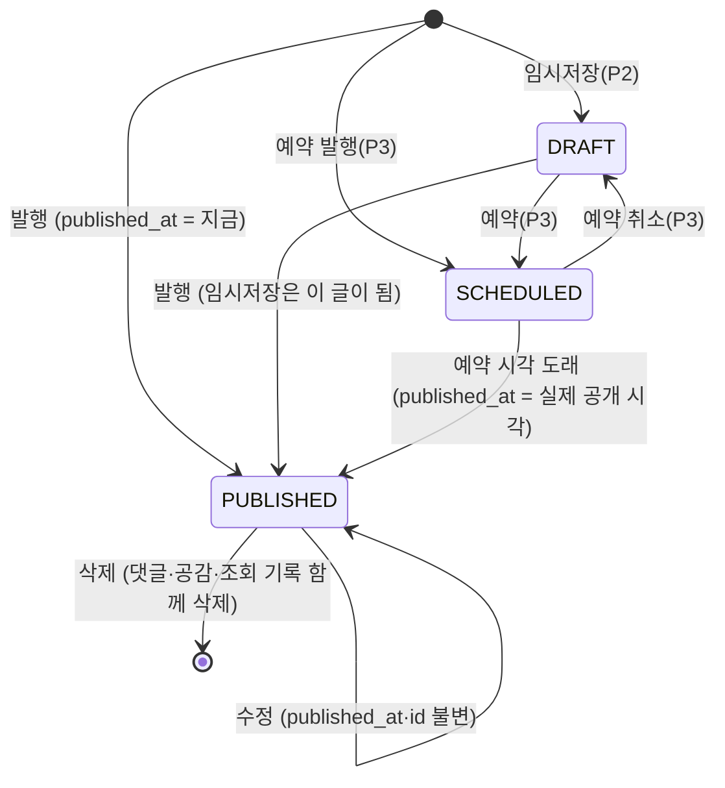

# Data Model: 한채 블로그 플랫폼

**Feature**: `001-blog` | **Date**: 2026-10-07 | **Plan**: [plan.md](./plan.md)

spec의 Key Entities를 Django 모델(MySQL 8.4 테이블)로 옮긴 것이다. 팀 ERD(`docs/ERD.md`)와 민주의 파트 2 DDL(`docs/erd_part2.sql`)을 바탕으로 하고, 한채가 고른 선택 항목에 맞춰 줄이거나 더했다. 달라진 점은 맨 아래 "팀 ERD와 다른 점"에 모았다.

**표기**: `PK` 기본 키, `FK` 외래 키, `UK` 유일, `null` 비워 둘 수 있음. 시각은 모두 UTC로 저장하고 화면에서 한국 시간으로 바꾼다(FR-118). 모든 테이블에 `created_at`이 있고, 고칠 수 있는 테이블에는 `updated_at`이 있다(아래 표에서는 생략).

---

## 1. 관계도

P3 전용 엔티티(저장, 알림, 신고, 블로그 제재, 방문 통계, 차단·금칙어, 공지, 관리 이력)는 6절에 따로 둔다.

---

## 2. 회원·인증 (`accounts` 앱)

### User (`accounts_user`)

Django `AbstractBaseUser` + `PermissionsMixin`을 바탕으로 한 사용자 정의 모델.

| 필드 | 타입 | 규칙 |
| --- | --- | --- |
| id | BIGINT PK | |
| email | VARCHAR(254) UK null | 이메일 가입자는 필수. 소셜 가입자는 제공사가 준 경우만. 대소문자 무시 비교 |
| password | VARCHAR(128) | Argon2 해시. 소셜 전용 회원은 사용 불가 표시 |
| nickname | VARCHAR(20) | 1~20자, 중복 허용(FR-003) |
| profile_image | FK → Image null | 없으면 기본 이미지 |
| role | VARCHAR(10) | `MEMBER` \| `ADMIN`. 기본 `MEMBER`. `ADMIN`은 관리 명령으로만 지정(FR-100) |
| is_active | BOOL | 탈퇴하면 false |
| withdrawn_at | DATETIME null | 탈퇴 시각(FR-008, P3) |
| last_login | DATETIME null | |

- 로그인 방식은 allauth 테이블로 알 수 있다: `account_emailaddress`(이메일, 인증 여부)와 `socialaccount_socialaccount`(provider `kakao`·`google`·`naver`, 제공사 uid). `(provider, uid)`는 유일.
- **이용 제한 여부**는 열로 두지 않고 `UserSanction`에서 계산한다(현재 시각이 기간 안이고 `released_at`이 비어 있으면 제한 중).
- **탈퇴 처리(FR-008)**: 행은 지우지 않는다. 이메일·닉네임·프로필·소셜 연결을 지우고 `is_active=false`, `withdrawn_at` 기록. 그 회원의 블로그는 삭제 처리(아래 Blog), 공감·구독·저장은 행 삭제, 댓글·방명록은 남기고 작성자 표시만 '탈퇴한 회원'.

---

## 3. 블로그 (`blogs` 앱)

### Blog (`blogs_blog`)

| 필드 | 타입 | 규칙 |
| --- | --- | --- |
| id | BIGINT PK | |
| owner | FK → User | |
| address | VARCHAR(32) UK | 영문 소문자·숫자·하이픈 4~32자, 하이픈으로 시작·끝 불가, 예약어 불가(FR-011). **변경 불가. 삭제돼도 행이 남아 영구 예약**(FR-012) |
| name | VARCHAR(40) | 1~40자(FR-119) |
| description | VARCHAR(200) | 빈 값 허용. 비면 소개 자리 숨김(FR-014) |
| profile_image | FK → Image null | 없으면 기본 이미지 |
| skin, header_image | VARCHAR, FK null | P3(FR-017) |
| deleted_at | DATETIME null | 블로그 삭제·탈퇴 시각(FR-018) |
| active_owner_id | BIGINT **생성 열** UK null | `IF(deleted_at IS NULL, owner_id, NULL)`. 살아 있는 블로그는 회원당 하나(FR-010) |

- MySQL은 조건부 유일 인덱스가 없으므로, Django `GeneratedField`로 `active_owner_id`를 만들고 여기에 유일 제약을 건다. 삭제한 뒤 다른 주소로 다시 개설할 수 있다.
- **예약어**는 코드 상수(`blogs/reserved.py`)로 둔다. 서비스 최상위 경로(`accounts admin api blog manage me search topic ranking feed static media notice help about login logout signup www` 등)가 모두 들어가야 한다. 경로 방식 주소(`/{blog}`)가 서비스 화면과 겹치지 않게 하는 장치다.
- **블로그 삭제**: `deleted_at` 기록, 글·카테고리·태그·방명록·구독 행 삭제. 블로그 행과 주소는 남는다. 삭제된 블로그 주소로 들어오면 404.

### GuestbookEntry (`blogs_guestbookentry`) — P2

| 필드 | 타입 | 규칙 |
| --- | --- | --- |
| id | BIGINT PK | |
| blog | FK → Blog (CASCADE) | |
| author | FK → User (PROTECT) | 탈퇴 회원이면 '탈퇴한 회원' 표시 |
| content | TEXT | 1~1,000자 |
| client_token | CHAR(36) null | 중복 등록 방지. `(author, client_token)` 유일 |
| hidden_at, hidden_reason, hidden_by | | 관리자 숨김(FR-103) |

---

## 4. 글·분류 (`posts` 앱)

### Topic (`posts_topic`)

| 필드 | 타입 | 규칙 |
| --- | --- | --- |
| id | SMALLINT PK | |
| name | VARCHAR(20) UK | research.md 15절의 10개 |
| slug | VARCHAR(30) UK | 주소용 이름(`/topic/{slug}`) |
| sort_order | SMALLINT | |

데이터 마이그레이션으로 넣는다. 화면에서 추가·수정하지 않는다.

### Category (`posts_category`)

| 필드 | 타입 | 규칙 |
| --- | --- | --- |
| id | BIGINT PK | |
| blog | FK → Blog (CASCADE) | |
| parent | FK → Category null (PROTECT) | 한 단계까지(FR-042, P2). 하위가 있으면 삭제 불가 |
| name | VARCHAR(20) | 1~20자(FR-040) |
| sort_order | INT | 사이드바 순서(FR-043, P2) |
| is_private | BOOL | P3(FR-044) |
| parent_key | BIGINT **생성 열** | `IFNULL(parent_id, 0)`. `(blog, parent_key, name)` 유일 |

- '전체 글'과 '미분류'는 행으로 두지 않는다. 미분류 = `post.category IS NULL`. 따라서 이름을 바꾸거나 지울 수 없다.
- 카테고리를 지우면 소속 글은 `category=NULL`(미분류)이 된다(`SET_NULL`). 한 트랜잭션에서 처리.
- 상위 카테고리의 하위를 다시 하위로 둘 수 없다(모델 검증).

### Tag (`posts_tag`), PostTag (`posts_post_tags`)

| Tag 필드 | 타입 | 규칙 |
| --- | --- | --- |
| id | BIGINT PK | |
| blog | FK → Blog (CASCADE) | |
| name | VARCHAR(30) | 1~30자, 앞뒤 공백 제거. `(blog, name)` 유일 |

- PostTag: `(post, tag)` 복합 PK. 글당 최대 10개(FR-045, 폼 검증). 태그 삭제(P3) 시 연결만 사라진다.

### Post (`posts_post`)

| 필드 | 타입 | 규칙 |
| --- | --- | --- |
| id | BIGINT PK | **글 주소 번호**(`/{blog}/{id}`). 서비스 전체에서 유일, 바뀌지 않음(FR-024) |
| blog | FK → Blog (CASCADE) | |
| category | FK → Category null (SET_NULL) | null이면 미분류 |
| topic | FK → Topic null (SET_NULL) | null이면 주제 없음(FR-036) |
| title | VARCHAR(100) | 발행 시 앞뒤 공백 뺀 1~100자(FR-021). 임시저장은 빈 값 허용 |
| content | LONGTEXT | nh3로 정리한 HTML(FR-022, FR-116) |
| content_text | LONGTEXT | 태그를 걷어 낸 순수 텍스트. 검색·요약용 |
| thumbnail | FK → Image null | 대표 이미지(P2). null이면 본문 첫 이미지 |
| visibility | VARCHAR(10) | `PUBLIC` \| `PRIVATE`. 기본 `PUBLIC`(FR-030) |
| status | VARCHAR(10) | `DRAFT` \| `SCHEDULED` \| `PUBLISHED` |
| scheduled_at | DATETIME null | 예약 시각(P3) |
| published_at | DATETIME null | **처음 공개된 시각.** 수정해도 불변. 목록 정렬 기준 |
| is_comment_allowed | BOOL | 기본 true(P3, FR-056) |
| view_count | INT UNSIGNED | 중복 제외 조회수(FR-034) |
| hidden_at, hidden_reason, hidden_by | DATETIME, VARCHAR(200), FK null | 관리자 숨김(FR-103) |
| client_token | CHAR(36) null | 발행 중복 방지. `(blog, client_token)` 유일(FR-117) |

**인덱스**

- `(blog, status, published_at, id)`: 블로그 글 목록
- `(status, visibility, published_at, id)`: 홈 최신 글
- `(topic, published_at, id)`: 주제별 글
- `(category, published_at, id)`: 카테고리 글 목록
- `FULLTEXT(title, content_text) WITH PARSER ngram`: 검색(마이그레이션 `RunSQL`)

**상태 변화**

- 공개 범위(`visibility`)와 관리자 숨김(`hidden_at`)은 상태와 따로 움직인다.
- 발행된 글은 임시저장으로 되돌리지 않는다. 숨기려면 비공개로 바꾼다.

**볼 수 있는 글 (FR-028, FR-031)**

주인이 아닌 사람에게 보이는 글은 아래를 모두 만족하는 글이다. `Post.objects.visible_to(viewer)` 한 곳에서만 계산한다.

1. 블로그가 살아 있다(`blog.deleted_at IS NULL`)
2. 블로그 주인이 이용 제한 중이 아니고 탈퇴하지 않았다(FR-102). 블로그 제재(P3)도 없다
3. `hidden_at IS NULL`
4. `status = PUBLISHED`이고 `visibility = PUBLIC`
5. 카테고리가 비공개가 아니다(P3)

블로그 주인은 1·2를 만족하는 자기 블로그의 모든 글을 본다. 관리자가 숨긴 글은 주인에게 보이되 숨김 사유가 함께 보인다(FR-090).

### Image (`posts_image`)

| 필드 | 타입 | 규칙 |
| --- | --- | --- |
| id | BIGINT PK | |
| uploader | FK → User (CASCADE) | |
| post | FK → Post null (SET_NULL) | 본문 이미지면 글. 글 저장 전이면 null |
| file | VARCHAR(255) | 저장 경로. 이름은 UUID |
| content_type | VARCHAR(20) | `image/jpeg` \| `image/png` \| `image/gif` \| `image/webp` |
| width, height | INT | |
| size_bytes | INT | 10MB 이하 |

- 글 저장 후 24시간이 지나도 어떤 글·프로필에도 안 쓰인 이미지는 정리 명령으로 지운다.

### PostView (`posts_postview`)

| 필드 | 타입 | 규칙 |
| --- | --- | --- |
| id | BIGINT PK | |
| post | FK → Post (CASCADE) | |
| viewer_key | CHAR(64) | 회원 ID 또는 쿠키 값의 SHA-256 |
| viewed_at | DATETIME | |

- 인덱스: `(post, viewer_key, viewed_at)` 중복 판단용, `(viewed_at, post)` 집계용.
- 30분 안에 같은 `(post, viewer_key)`가 있으면 넣지 않는다(research.md 8절).
- 24시간 순위 대체 기준 때문에 **최소 25시간**은 보관한다. 정각 작업이 7일 넘은 기록을 지운다.

---

## 5. 소통·탐색

### Comment (`comments_comment`)

| 필드 | 타입 | 규칙 |
| --- | --- | --- |
| id | BIGINT PK | |
| post | FK → Post (CASCADE) | 글이 지워지면 함께 삭제 |
| author | FK → User (PROTECT) | 탈퇴 회원이면 '탈퇴한 회원' |
| parent | FK → Comment null (CASCADE) | 답글(P3). 한 단계만 |
| content | TEXT | 1~1,000자. 순수 텍스트로 저장하고 화면에서 이스케이프 |
| is_secret | BOOL | P3 |
| deleted_at | DATETIME null | 답글이 있는 댓글을 지우면 행을 남기고 '삭제된 댓글'(P3). 답글이 없으면 행 삭제 |
| hidden_at, hidden_reason, hidden_by | | 관리자 숨김. '관리자가 숨긴 댓글' 표시 |
| client_token | CHAR(36) null | `(author, client_token)` 유일 |

- 정렬: `created_at, id` 오름차순(작성순, FR-050).
- 댓글 수 = 그 글의 `deleted_at IS NULL AND hidden_at IS NULL`인 댓글 수(실시간 계산).

### PostLike (`social_postlike`)

| 필드 | 타입 | 규칙 |
| --- | --- | --- |
| user | FK → User (CASCADE) | |
| post | FK → Post (CASCADE) | `(user, post)` 유일 |

- 자기 글에는 만들 수 없다(FR-057, 서비스 계층 검사). 공감 수 = 행 수.

### Subscription (`social_subscription`) — P2

| 필드 | 타입 | 규칙 |
| --- | --- | --- |
| subscriber | FK → User (CASCADE) | |
| blog | FK → Blog (CASCADE) | `(subscriber, blog)` 유일. 자기 블로그 불가 |

- 구독자 수 = 행 수. 피드 = 구독한 블로그의 `visible_to(viewer)` 글을 커서 방식으로.

### RankingSnapshot (`discovery_rankingsnapshot`), RankingEntry — P2

| Snapshot 필드 | 타입 | 규칙 |
| --- | --- | --- |
| id | BIGINT PK | |
| kind | VARCHAR(10) | `POST` \| `BLOGGER`(P3) |
| window_end | DATETIME | 집계 기준 정각. `(kind, window_end)` 유일 |
| basis | VARCHAR(5) | `1H` \| `24H` \| `EMPTY` (FR-082 대체 기준) |

| Entry 필드 | 타입 | 규칙 |
| --- | --- | --- |
| snapshot | FK (CASCADE) | |
| rank | SMALLINT | 1부터 |
| post | FK → Post null (CASCADE) | kind=POST |
| blog | FK → Blog null (CASCADE) | kind=BLOGGER |
| score | INT | 조회수(인기 블로거는 블로그 글 조회수 합) |

- 매 정각 `compute_rankings`가 직전 1시간 `PostView`를 집계한다. 대상은 집계 시점에 `visible_to(익명)`인 글뿐이다. 1시간이 비면 24시간으로 다시 세고 `basis=24H`, 그것도 비면 `EMPTY`.
- 동점은 `published_at`이 늦은 글이 위.
- 화면은 가장 최근 스냅숏을 읽되, 읽을 때 한 번 더 `visible_to`로 거른다. 정각 사이에 비공개로 바뀐 글도 즉시 빠진다(SC-003). 순위 번호는 남은 글 기준으로 다시 매기지 않고 빈 자리를 건너뛴다.
- 상위 100위까지만 저장한다.

---

## 6. 서비스 관리 (`moderation` 앱)

### UserSanction (`moderation_usersanction`) — P2

| 필드 | 타입 | 규칙 |
| --- | --- | --- |
| id | BIGINT PK | |
| user | FK → User | ADMIN은 대상이 될 수 없음(FR-101) |
| admin | FK → User | 처리한 관리자 |
| reason | VARCHAR(500) | 필수 |
| starts_at | DATETIME | |
| ends_at | DATETIME null | null이면 영구 |
| released_at, released_by | DATETIME null, FK null | 기한 전 해제 |

- 제한 중 = `starts_at <= now AND (ends_at IS NULL OR ends_at > now) AND released_at IS NULL`. 기한이 지나면 작업 없이 자동으로 풀린다.
- 로그인한 상태에서 제한되면 다음 요청부터 막는다(미들웨어가 매 요청 확인 후 로그아웃·안내).

### AdminLog (`moderation_adminlog`) — 숨김·제한 기록(P2부터 쓰기 시작, 화면은 P3)

| 필드 | 타입 | 규칙 |
| --- | --- | --- |
| id | BIGINT PK | |
| admin | FK → User | |
| action | VARCHAR(30) | `HIDE_POST` `UNHIDE_POST` `HIDE_COMMENT` `UNHIDE_COMMENT` `SANCTION_USER` `RELEASE_USER` 등 |
| target_type, target_id | VARCHAR(20), BIGINT | |
| reason | VARCHAR(500) | |

- **추가만 가능**(FR-106). 모델의 `save`(수정)와 `delete`를 막고, 운영 DB 계정에서도 이 테이블의 UPDATE·DELETE 권한을 뺀다.

### P3 엔티티 (구현은 해당 이야기 때)

팀 ERD의 정의를 그대로 따른다. 지금 테이블을 미리 만들지 않는다.

| 엔티티 | 팀 ERD 이름 | 메모 |
| --- | --- | --- |
| 저장 | POST_SAVE | `(user, post)` 유일. 볼 수 없게 된 글은 목록에서 거름 |
| 알림 | NOTIFICATION | 수신자 = 행위자면 만들지 않음 |
| 신고 | REPORT | `(reporter, target_type, target_id)` 유일. 자동 숨김 없음 |
| 블로그 제재 | BLOG.restricted_at | 블로그 테이블에 열 추가 |
| 방문 통계 | VISIT_STAT | `(blog, date)` 유일, 고유 방문자 키 수 |
| 댓글 차단·금칙어 | BLOG_BLOCKED_USER, BLOG_BANNED_WORD | |
| 공지 | NOTICE | |

---

## 7. 삭제·탈퇴 때 함께 처리되는 것

모두 한 트랜잭션 안에서 처리한다(FR-117 "일부만 처리된 상태로 남지 않음").

| 작업 | 함께 삭제 | 남김 |
| --- | --- | --- |
| 글 삭제 | 댓글, 공감, 태그 연결, 조회 기록, 순위 항목, (P3) 저장·알림 | 이미지 파일은 정리 명령이 나중에 |
| 카테고리 삭제 | 없음 | 글은 미분류로 이동 |
| 태그 삭제(P3) | 태그 연결 | 글 |
| 블로그 삭제(P3) | 글(위 규칙대로), 카테고리, 태그, 방명록, 구독 | 블로그 행(주소 영구 예약) |
| 회원 탈퇴(P3) | 블로그(위 규칙대로), 공감, 구독, 저장, 알림, 소셜 연결 | 회원 행(익명화), 남의 글에 단 댓글·방명록('탈퇴한 회원') |

---

## 8. 팀 ERD와 다른 점

| 팀 ERD | 한채 | 이유 |
| --- | --- | --- |
| `USER.primary_blog_id`, `BLOG.moved_to_blog_id`, `POST_MOVE` | 없음 | 회원당 블로그 1개라 대표 블로그·이사 없음(spec Assumptions) |
| `POST.slug`, `protected_password_hash`, `content_format` | 없음 | 번호 주소(7.5), 확장 공개 범위 없음(7.8), WYSIWYG HTML 하나(7.4) |
| `BLOG.topic_id` | 없음 | 주제는 글마다(7.7) |
| `RESERVED_WORD` 테이블 | 코드 상수 | 라우팅과 함께 바뀌어야 하므로 코드에 둠 |
| `USER.email/password/social_*` | User + allauth 테이블 | 이메일 인증·소셜 연결을 allauth가 관리 |
| 없음 | `POST.content_text` | 검색·요약용 순수 텍스트 |
| 없음 | `POST_VIEW.viewer_key`(파트 2에 있음), `RANKING_SNAPSHOT/ENTRY` | 중복 조회 방지, 정각 순위 저장(FR-082) |
| 없음 | `client_token` 열 | 중복 요청 방지(FR-117) |
| 없음 | `BLOG.active_owner_id`, `CATEGORY.parent_key` 생성 열 | MySQL에서 조건부 유일 제약을 대신함 |
| `posts.visibility`에 `SUBSCRIBERS` | `PUBLIC`·`PRIVATE`만 | 7.8 |
